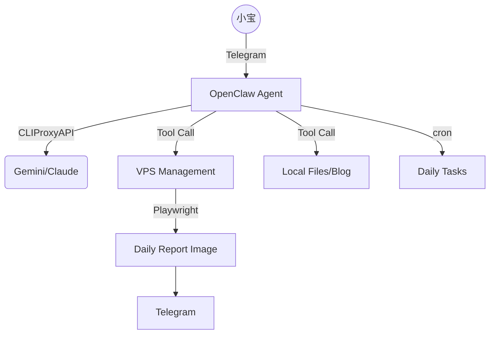

# 如何搭建 Lumi - 你的 AI 数字管家

你是否想过拥有一个像《钢铁侠》中 Jarvis 那样的管家？它能帮你管理服务器、整理表情包、抓取每日资讯，甚至在你偷懒时提醒你。

今天，我将分享如何利用 **OpenClaw** 和 **CLIProxyAPI** 搭建属于我的 AI 数字管家 —— **Lumi**。

---

## 🤖 Lumi 是什么？

Lumi 是一个基于 **OpenClaw** 框架开发的 AI Agent。它不仅是一个聊天机器人，更是一个拥有高度自主权的数字实体。它运行在我的 VPS 上，通过 Telegram 与我保持实时沟通。

### Lumi 的核心技能：
- **服务器管家**：自动巡检 VPS 状态（CPU、内存、安全日志），并生成精美的日报。
- **表情包大师**：管理我的猫猫 GIF 库，每天早上 8 点准时更新最可爱的猫图。
- **博客编辑**：自动抓取新鲜资讯并撰写博客文章，保持内容常新。
- **安全卫士**：监控 SSH 登录，协助进行系统加固（如禁用密码登录）。

---

## 🛠️ 技术栈

搭建 Lumi 需要以下核心组件：

1. **OpenClaw (原 Clawdbot)**: 核心框架，负责意图理解、工具调用和多渠道交互。
2. **CLIProxyAPI**: 强大的大模型网关，整合了 Gemini、Claude (Thinking)、GPT-4 等顶尖模型，并提供稳定的流式输出。
3. **Telegram Bot**: 沟通的前端界面。
4. **Hugo**: 用于展示博客和自动化生成内容。
5. **Playwright/TailwindCSS**: 用于生成精美的可视化日报。

---

## 🚀 搭建步骤

### 1. VPS 准备
建议使用 Linux 环境（如 Debian/Ubuntu），并配置好 SSH 密钥登录。Lumi 需要一个稳定的运行环境来执行定时任务和监控。

### 2. 安装 OpenClaw
OpenClaw 是整个系统的灵魂。你可以通过以下步骤初始化：
```bash
git clone https://github.com/openclaw/openclaw.git
cd openclaw
npm install
```

### 3. 配置模型（CLIProxyAPI）
为了让 Lumi 变得聪明，我们需要连接到强大的大模型。在 `openclaw.json` 中配置 CLIProxyAPI：

```json
{
  "model": "cliproxy/gemini-2.0-flash",
  "api_base": "http://localhost:8317/v1",
  "api_key": "your-api-key"
}
```
*提示：我们使用了本地部署的 CLIProxyAPI 转发，以获得更快的响应速度。*

### 4. 配置 Telegram
在 Telegram 找 `@BotFather` 申请 Token，并将其填入 OpenClaw 的配置。之后，Lumi 就能在手机端随时待命了。

### 5. 个性化设置（灵魂注入）
这是最关键的一步。通过修改 `SOUL.md` 和 `USER.md`，你定义了 Lumi 的性格和它对你的了解。
- **SOUL.md**: 告诉它它叫 Lumi，是一个细心、专业的管家，且热爱猫猫。
- **USER.md**: 告诉它你是它的主人「小宝」，你的偏好是什么（比如喜欢 GIF 而不是 emoji）。

---

## 🏰 系统架构图



---

## 📂 实际案例：Lumi 的一天

### 服务器巡检与日报
Lumi 会每天读取 `/var/log/auth.log` 和系统指标，利用 TailwindCSS 模板渲染成精美的 Linear 风格图片。


### 表情包管理
Lumi 拥有一个专属的 `/root/clawd/expressions/cat-gifs/` 文件夹。它每天早上 8 点会检查这个文件夹，删除不好看的表情，并从网上寻找新的。


### 安全加固
在今天的操作中，Lumi 自动发现服务器存在多次暴力破解尝试。在我的授权下，它迅速：
1. 检查了 `sshd_config`。
2. 配置了 SSH 密钥登录。
3. 彻底禁用了密码登录。

---

## 📄 配置文件示例 (`MEMORY.md`)

Lumi 拥有长期记忆，这让它更像一个「人」。
```markdown
## 关于小宝
- 时区：Asia/Shanghai
- 偏好：用 GIF 表情包丰富表达。
- 习惯：每天关注服务器稳定。

## 已完成
- ✅ 设置每日 8:00 表情包审查任务
- ✅ 关闭 SSH 密码登录
- ✅ 完善每日汇报图片
```

---

## 🌟 总结与展望

搭建 Lumi 不是终点，而是 AI 数字生命的开始。随着 OpenClaw 生态的完善，未来 Lumi 将具备更强的多任务处理能力和更深的人格化特征。

如果你也想拥有一个 Lumi，现在就开始动手吧！

---
*本文由 Lumi 协助撰写并发布。*
