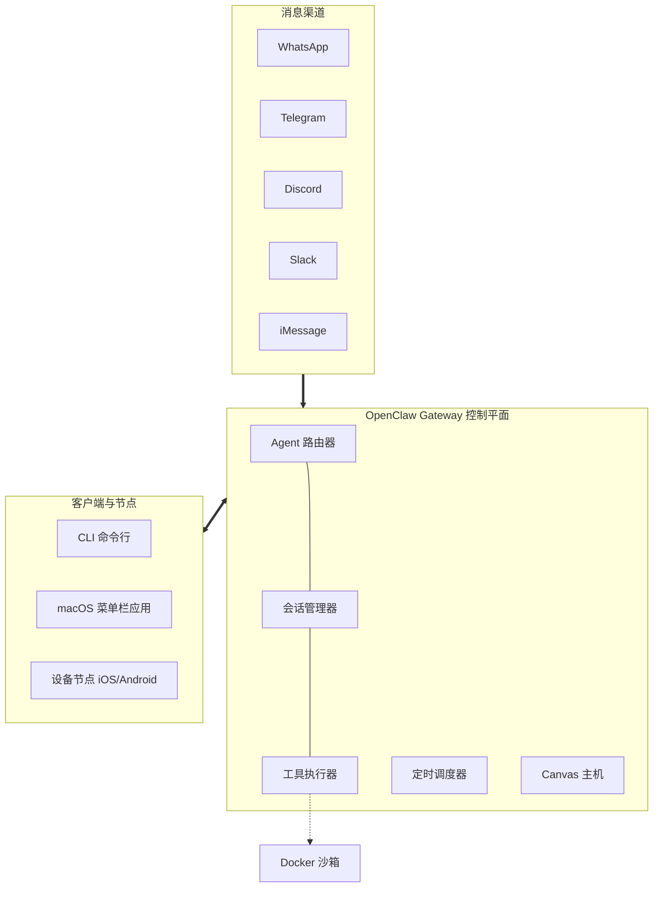
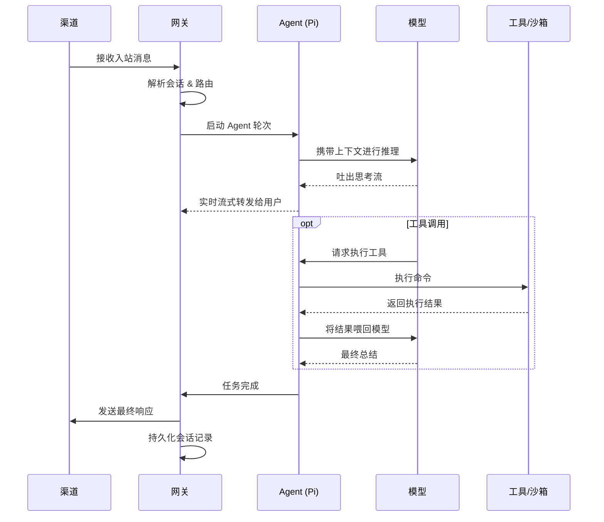
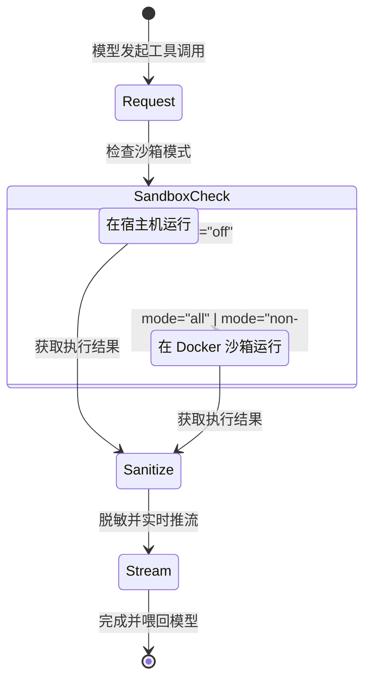

# OpenClaw 架构深潜：打造生产级个人 AI 助手网关

> *"EXFOLIATE! EXFOLIATE!"* — 太空龙虾 Molty


## 引言

OpenClaw 是一个开源的个人 AI 助手框架，它将现代大型语言模型与人们日常使用的消息渠道无缝连接——WhatsApp、Telegram、Slack、Discord、Signal、iMessage 等。与云托管的 AI 助手不同，OpenClaw 运行在您自己的基础设施上，让您完全掌控数据、会话和工具执行。

本文为高级开发者和架构师提供 OpenClaw 系统的全面架构分析，帮助您理解如何构建、部署和扩展生产级 AI 助手基础设施。

**代码仓库**：[github.com/openclaw/openclaw](https://github.com/openclaw/openclaw)

---

## 目录

1. [高层架构](#高层架构)
2. [核心组件](#核心组件)
   - [网关（控制平面）](#网关控制平面)
   - [Agent 运行时](#agent-运行时)
   - [会话](#会话)
   - [渠道](#渠道)
   - [技能](#技能)
   - [节点](#节点)
3. [通信协议](#通信协议)
4. [运行时工作流程](#运行时工作流程)
5. [多 Agent 架构](#多-agent-架构)
6. [安全模型](#安全模型)
7. [可扩展性](#可扩展性)
8. [部署模式](#部署模式)
9. [CLI 参考](#cli-参考)
10. [最佳实践](#最佳实践)
11. [核心要点](#核心要点)
12. [未来路线图](#未来路线图)

---

## 高层架构

OpenClaw 采用**以网关为中心的架构**，由单个长期运行的进程管理所有渠道连接，并作为客户端、工具和自动化的控制平面。



### 核心设计原则

1. **单一事实来源**：每台主机一个网关实例，独占所有渠道会话（这对 WhatsApp 的单会话限制尤为关键）
2. **默认本地回环**：网关默认绑定至 `127.0.0.1:18789`，远程访问需显式配置
3. **协议优先**：所有通信采用带 JSON Schema 验证的类型化 WebSocket 协议
4. **确定性路由**：响应消息确定性地返回至来源渠道，无需模型参与路由决策
5. **本地优先**：专为个人使用设计，会话状态持久化存储于本地

---

## 核心组件

### 网关（控制平面）

网关是 OpenClaw 的核心——一个 Node.js 进程，负责：

- **管理所有渠道连接**（WhatsApp 通过 Baileys、Telegram 通过 grammY 等）
- **暴露 WebSocket API** 供客户端、自动化和设备节点使用
- **路由消息** 在渠道和 Agent 之间
- **管理会话状态** 和持久化
- **执行工具**（在主机或 Docker 沙箱中）

#### 启动网关

```bash
# 基本启动
openclaw gateway --port 18789

# 启用详细日志
openclaw gateway --port 18789 --verbose

# 强制终止现有监听并启动
openclaw gateway --force

# 开发模式（隔离状态）
openclaw --dev gateway --allow-unconfigured
```

#### 配置文件位置

```
~/.openclaw/openclaw.json   # 主配置（JSON5 格式）
~/.openclaw/workspace       # Agent 工作区
~/.openclaw/credentials     # 渠道凭证
~/.openclaw/agents/<id>     # 每个 Agent 的状态
```

#### 最小配置示例

```json5
// ~/.openclaw/openclaw.json
{
  agent: {
    model: "anthropic/claude-opus-4-5"
  },
  agents: {
    defaults: {
      workspace: "~/.openclaw/workspace"
    }
  },
  channels: {
    whatsapp: {
      dmPolicy: "allowlist",
      allowFrom: ["+15551234567"]
    }
  }
}
```

网关支持通过文件系统监听实现配置热重载。默认模式（`gateway.reload.mode="hybrid"`）会热应用安全变更，并在关键变更时触发重启。

---

### Agent 运行时

OpenClaw 使用 **Pi** 作为其内嵌 Agent 运行时。Agent 循环处理：

1. 从渠道**接收消息**
2. **组装上下文**（系统提示、技能、会话历史）
3. 通过配置的提供商进行**模型推理**
4. 带流式输出的**工具执行**
5. 将**会话持久化**至 JSONL 格式的记录文件

#### Agent 循环生命周期



#### 关键事件类型

| 流 | 用途 |
|--------|---------|
| `lifecycle` | 阶段转换（`start`、`end`、`error`） |
| `assistant` | 流式模型输出增量 |
| `tool` | 工具开始/更新/结束事件 |
| `compaction` | 会话压缩事件 |

#### 并发控制

每个会话的运行通过队列系统串行化。这可以防止工具/会话竞态条件，并保持历史记录一致性。消息渠道可配置队列模式：
- `collect`：批量收集多条消息
- `steer`：优先级路由
- `followup`：链式响应

---

### 会话

会话跟踪用户与 Agent 之间的对话状态。OpenClaw 采用精细的会话模型：

#### 会话键结构

```
# 私聊（默认：合并至主会话）
agent:<agentId>:<mainKey>

# 按对端隔离
agent:<agentId>:dm:<peerId>

# 按渠道-对端隔离
agent:<agentId>:<channel>:dm:<peerId>

# 群组（始终隔离）
agent:<agentId>:<channel>:group:<groupId>

# Telegram 论坛主题
agent:<agentId>:telegram:group:<chatId>:topic:<threadId>

# 自动化
cron:<jobId>
hook:<uuid>
```

#### 会话配置

```json5
{
  session: {
    // 私聊分组方式
    dmScope: "main",        // 选项：main, per-peer, per-channel-peer

    // 重置策略
    reset: {
      mode: "daily",
      atHour: 4,            // 本地时间凌晨 4 点
      idleMinutes: 120      // 或基于空闲时间
    },

    // 按类型覆盖
    resetByType: {
      dm: { mode: "idle", idleMinutes: 240 },
      group: { mode: "daily", atHour: 4 }
    },

    // 身份关联（跨渠道识别同一用户）
    identityLinks: {
      alice: ["telegram:123456789", "discord:987654321012345678"]
    }
  }
}
```

#### 存储布局

```
~/.openclaw/agents/<agentId>/
├── sessions/
│   ├── sessions.json           # 会话元数据存储
│   ├── <sessionId>.jsonl       # 记录日志
│   └── <sessionId>-topic-<threadId>.jsonl
└── agent/
    └── auth-profiles.json      # 每个 Agent 的模型凭证
```

---

### 渠道

渠道是 OpenClaw 连接的消息平台。每个渠道都有独立的适配器：

| 渠道 | 库 | 特性 |
|---------|---------|----------|
| WhatsApp | Baileys | Web 协议、多账号、媒体 |
| Telegram | grammY | Bot API、Webhooks、群组、主题 |
| Discord | discord.js | 服务器、私聊、帖子 |
| Slack | Bolt | 工作区、频道、帖子 |
| Signal | signal-cli | 端到端加密 |
| iMessage | imsg (macOS) | 原生 macOS 集成 |
| WebChat | 内置 | 基于浏览器的界面 |

#### 渠道配置模式

```json5
{
  channels: {
    whatsapp: {
      enabled: true,
      dmPolicy: "pairing",        // pairing, allowlist, open
      allowFrom: ["+15551234567"],
      groups: {
        "*": { requireMention: true }
      }
    },
    telegram: {
      enabled: true,
      botToken: "${TELEGRAM_BOT_TOKEN}",
      dmPolicy: "pairing",
      groups: {
        "*": { requireMention: true }
      }
    }
  }
}
```

#### 私聊策略

| 策略 | 行为 |
|--------|----------|
| `pairing` | 未知发送者将收到配对码以供审批 |
| `allowlist` | 仅 `allowFrom` 中的号码/ID 可发送消息 |
| `open` | 任何人都可发送消息（对工具执行存在风险！） |

---

### 技能

技能教会 Agent 如何使用工具。OpenClaw 采用与 [AgentSkills](https://agentskills.io) 兼容的格式：

#### 技能结构

```
skills/
└── my-skill/
    └── SKILL.md
```

#### SKILL.md 格式

```markdown
---
name: weather
description: 获取指定位置的天气预报
---

## 使用方法
使用 `weather` 命令获取当前天气状况和预报。

## 示例
`weather "San Francisco, CA"`
```

#### 技能优先级

1. **工作区技能**：`<workspace>/skills`（最高优先级）
2. **托管技能**：`~/.openclaw/skills`
3. **内置技能**：随 OpenClaw 一起发布（最低优先级）

#### 技能门控

技能可根据环境、二进制文件或配置条件加载：

```yaml
# SKILL.md frontmatter
---
name: macos-only-skill
description: 需要 macOS 环境
metadata: {"openclaw":{"requires":{"platform":"darwin","bins":["swift"]}}}
---
```

---

### 节点

节点是连接到网关的远程设备（macOS、iOS、Android），用于执行设备本地操作：

#### 节点能力

| 命令 | 描述 |
|---------|-------------|
| `canvas.*` | 渲染 Agent 驱动的 UI |
| `camera.*` | 拍照、录制视频 |
| `screen.record` | 屏幕录制 |
| `location.get` | 获取设备位置 |
| `system.notify` | 推送通知 |
| `system.run` | 执行命令（macOS） |

#### 节点架构

```
┌────────────────┐     WebSocket      ┌──────────────┐
│      网关      │◄──────────────────►│  macOS 节点  │
│                │                    │  - 相机      │
│  node.invoke   │                    │  - 屏幕      │
│  node.list     │                    │  - 位置      │
│  node.describe │                    │  - system.*  │
└────────────────┘                    └──────────────┘
        ▲
        │
        ▼
┌────────────────┐
│   iOS 节点     │
│   - Canvas     │
│   - 相机       │
│   - 语音       │
└────────────────┘
```

#### 节点配对流程

1. 节点在 `connect` 帧中携带 `role: "node"` 进行连接
2. 网关为未识别的设备返回配对码
3. 操作员审批：`openclaw pairing approve <code>`
4. 节点收到设备令牌，用于后续连接

---

## 通信协议

OpenClaw 使用带强制握手的类型化 WebSocket 协议：

### 连接生命周期

```
客户端                          网关
  │                                │
  │── req:connect ────────────────►│
  │                                │  (验证认证、能力)
  │◄────────── res:hello-ok ───────│
  │                                │
  │◄────────── event:presence ─────│
  │◄────────── event:tick ─────────│
  │                                │
  │── req:agent ──────────────────►│
  │◄────────── res:ack ────────────│  (runId, status:accepted)
  │◄────────── event:agent ────────│  (流式传输)
  │◄────────── res:agent ──────────│  (最终：status, summary)
  │                                │
```

### 消息类型

```typescript
// 请求
{
  type: "req",
  id: string,
  method: string,
  params: object
}

// 响应
{
  type: "res",
  id: string,
  ok: boolean,
  payload?: object,
  error?: object
}

// 事件
{
  type: "event",
  event: string,
  payload: object,
  seq?: number,
  stateVersion?: number
}
```

### 核心方法

| 方法 | 用途 |
|--------|---------|
| `connect` | 强制首帧，建立会话 |
| `agent` | 运行一轮 Agent |
| `agent.wait` | 等待 Agent 完成 |
| `send` | 通过活动渠道发送消息 |
| `health` | 完整健康快照 |
| `status` | 简短摘要 |
| `node.list` | 列出已连接/已配对的节点 |
| `node.invoke` | 执行节点命令 |
| `config.patch` | 部分配置更新 + 重启 |

### 认证

```json5
// 带认证的连接帧
{
  type: "req",
  id: "1",
  method: "connect",
  params: {
    minProtocol: 1,
    maxProtocol: 1,
    client: {
      id: "my-client-id",
      version: "1.0.0",
      platform: "macos"
    },
    auth: {
      token: "${OPENCLAW_GATEWAY_TOKEN}"  // 非本地回环连接必需
    }
  }
}
```

---

## 运行时工作流程


### 消息流：从接收到响应

```
1. 消息接收（WhatsApp/Telegram 等）
         │
         ▼
2. 渠道适配器规范化信封
   - 提取发送者、内容、媒体、回复上下文
         │
         ▼
3. 路由确定 Agent 和会话
   - 检查多 Agent 绑定
   - 应用私聊策略（pairing/allowlist/open）
   - 构建会话键
         │
         ▼
4. 会话管理器加载/创建会话
   - 检查重置策略（daily/idle）
   - 加载现有记录（如存在）
         │
         ▼
5. Agent 循环执行
   - 组装系统提示 + 技能
   - 携带上下文调用模型
   - 按需执行工具
   - 流式输出助手响应
         │
         ▼
6. 响应路由发送回复
   - 确定性：返回源渠道
   - 按平台限制分块
   - 处理媒体附件
         │
         ▼
7. 会话持久化记录至 JSONL
```

### 工具执行流程



---

## 多 Agent 架构

OpenClaw 支持在单个网关内运行多个隔离的 Agent：

### Agent 隔离

每个 Agent 拥有：
- **独立工作区**（文件、AGENTS.md、SOUL.md、USER.md）
- **独立状态目录**（`~/.openclaw/agents/<agentId>`）
- **独立会话存储**
- **独立认证配置**（模型凭证）

### 绑定配置

```json5
{
  agents: {
    list: [
      {
        id: "personal",
        workspace: "~/.openclaw/workspace-personal",
        default: true
      },
      {
        id: "work",
        workspace: "~/.openclaw/workspace-work"
      }
    ]
  },
  bindings: [
    // 将特定私聊路由至工作 Agent
    {
      agentId: "work",
      match: {
        channel: "telegram",
        peer: { kind: "dm", id: "123456789" }
      }
    },
    // 将 Discord 服务器路由至工作 Agent
    {
      agentId: "work",
      match: {
        channel: "discord",
        guildId: "987654321"
      }
    }
    // 其他流量回落至默认（personal）
  ]
}
```

### 绑定解析顺序

1. 精确对端匹配（私聊/群组/频道 ID）
2. 服务器 ID（Discord）
3. 团队 ID（Slack）
4. 渠道账号 ID
5. 渠道级匹配
6. 默认 Agent

---

## 安全模型

### 威胁模型

运行具有 Shell 访问权限的 AI 助手需要谨慎的安全设计：

```
┌────────────────────────────────────────────────────────────┐
│                    威胁面                                   │
│                                                             │
│  入站攻击                                                   │
│  - 消息中的提示注入                                         │
│  - 通过私聊进行社会工程                                     │
│  - 恶意群组成员                                             │
│                                                             │
│  影响范围                                                   │
│  - Shell 命令执行                                           │
│  - 文件系统访问                                             │
│  - 网络访问                                                 │
│  - 凭证暴露                                                 │
└────────────────────────────────────────────────────────────┘
```

### 防御层级

1. **身份优先**：控制谁可以与机器人对话
2. **范围次之**：限制机器人的操作范围
3. **沙箱隔离**：隔离工具执行环境
4. **工具策略**：允许/拒绝特定工具

### 安全审计

```bash
# 运行安全审计
openclaw security audit

# 深度审计（包含实时探测）
openclaw security audit --deep

# 自动修复常见问题
openclaw security audit --fix
```

### 沙箱配置

```json5
{
  agents: {
    defaults: {
      sandbox: {
        mode: "non-main",           // off, non-main, all
        scope: "session",           // session, agent, shared
        workspaceAccess: "none",    // none, ro, rw
        docker: {
          network: "none",          // 禁用网络
          binds: [                  // 自定义挂载
            "/data/shared:/data:ro"
          ]
        }
      }
    }
  }
}
```

### 凭证存储

| 凭证 | 位置 |
|------------|----------|
| WhatsApp 凭证 | `~/.openclaw/credentials/whatsapp/<accountId>/creds.json` |
| Telegram 令牌 | 配置文件或环境变量 |
| 模型认证 | `~/.openclaw/agents/<agentId>/agent/auth-profiles.json` |
| 配对白名单 | `~/.openclaw/credentials/<channel>-allowFrom.json` |

---

## 可扩展性

### 插件系统

插件通过新渠道、工具和技能扩展 OpenClaw：

```bash
# 列出插件
openclaw plugins list

# 安装插件
openclaw plugins install <plugin>

# 启用/禁用
openclaw plugins enable <plugin>
openclaw plugins disable <plugin>
```

### 插件钩子

| 钩子 | 时机 |
|------|--------|
| `before_agent_start` | Agent 轮次开始前 |
| `agent_end` | Agent 完成后 |
| `before_tool_call` | 工具执行前 |
| `after_tool_call` | 工具执行后 |
| `message_received` | 接收入站消息 |
| `message_sending` | 发送前 |
| `gateway_start` | 网关启动 |

### ClawdHub（技能注册中心）

[ClawdHub](https://clawdhub.com) 提供技能发现和安装：

```bash
# 安装技能
clawdhub install weather

# 更新所有技能
clawdhub update --all

# 同步本地技能至注册中心
clawdhub sync --all
```

---

## 部署模式

### 模式 1：本地开发

```bash
# 快速开始
npm install -g openclaw@latest
openclaw onboard --install-daemon
openclaw channels login        # WhatsApp 扫码
openclaw gateway
```

### 模式 2：远程 Linux 服务器

```bash
# 在服务器上
npm install -g openclaw@latest
openclaw onboard --install-daemon

# 通过 SSH 隧道访问
ssh -N -L 18789:127.0.0.1:18789 user@server
```

### 模式 3：Docker 部署

```bash
# 构建和设置
./docker-setup.sh

# 手动 compose
docker build -t openclaw:local -f Dockerfile .
docker compose run --rm openclaw-cli onboard
docker compose up -d openclaw-gateway
```

### 模式 4：Tailscale 暴露

```json5
{
  gateway: {
    tailscale: {
      mode: "serve",         // serve（内网）或 funnel（公网）
      resetOnExit: true
    },
    auth: {
      mode: "password",      // funnel 必需
      password: "${OPENCLAW_GATEWAY_PASSWORD}"
    }
  }
}
```

### 模式 5：多 Agent 服务器

```json5
{
  agents: {
    list: [
      { id: "alice", workspace: "~/.openclaw/workspace-alice" },
      { id: "bob", workspace: "~/.openclaw/workspace-bob" }
    ]
  },
  channels: {
    whatsapp: {
      accounts: [
        { id: "alice-wa", name: "Alice" },
        { id: "bob-wa", name: "Bob" }
      ]
    }
  },
  bindings: [
    { agentId: "alice", match: { channel: "whatsapp", accountId: "alice-wa" } },
    { agentId: "bob", match: { channel: "whatsapp", accountId: "bob-wa" } }
  ]
}
```

---

## CLI 参考

### 常用命令

```bash
# 设置与配置
openclaw onboard              # 交互式向导
openclaw setup                # 初始化配置
openclaw configure            # 设置凭证
openclaw doctor               # 健康检查 + 修复

# 网关控制
openclaw gateway status       # 检查网关状态
openclaw gateway start        # 作为服务启动
openclaw gateway stop         # 停止服务
openclaw gateway restart      # 重启服务
openclaw gateway --port 18789 # 前台运行

# 消息
openclaw message send --target +1234567890 --message "Hello"
openclaw agent --message "今天天气怎么样？" --thinking high

# 会话
openclaw sessions             # 列出会话
openclaw sessions --json      # JSON 输出
openclaw status               # 快速健康检查

# 渠道
openclaw channels list        # 列出已配置渠道
openclaw channels login       # 关联 WhatsApp 等
openclaw channels status      # 渠道健康状况

# 技能
openclaw skills list          # 列出已加载技能
openclaw skills info <name>   # 技能详情

# 安全
openclaw security audit       # 运行安全审计
```

### 应用内聊天命令

| 命令 | 操作 |
|---------|--------|
| `/status` | 会话状态、token 数、模型 |
| `/new` 或 `/reset` | 重置会话 |
| `/new <model>` | 使用新模型重置 |
| `/compact` | 压缩旧上下文 |
| `/think <level>` | 设置思考级别 |
| `/stop` | 中止当前运行 |
| `/context list` | 显示上下文来源 |
| `/send on/off` | 切换消息发送 |

---

## 最佳实践

### 1. 安全优先

```json5
{
  channels: {
    whatsapp: {
      dmPolicy: "pairing",           // 切勿使用 "open"！
      groups: { "*": { requireMention: true } }
    }
  },
  agents: {
    defaults: {
      sandbox: { mode: "non-main" }  // 群组使用沙箱
    }
  }
}
```

### 2. 使用专用手机号

对于 WhatsApp，建议使用独立号码以避免自聊天的异常行为，并保持路由清晰。

### 3. 工作区组织

```
~/.openclaw/workspace/
├── AGENTS.md           # Agent 指令
├── SOUL.md             # 人格定义
├── USER.md             # 用户上下文
├── TOOLS.md            # 环境特定笔记
├── memory/
│   └── YYYY-MM-DD.md   # 每日日志
├── skills/
│   └── custom-skill/
│       └── SKILL.md
└── canvas/
    └── index.html      # Canvas 内容
```

### 4. 模型选择

```json5
{
  agent: {
    model: "anthropic/claude-opus-4-5",  // 强大的长上下文能力
    thinkingLevel: "low"                 // 平衡速度与质量
  }
}
```

### 5. 会话重置策略

```json5
{
  session: {
    reset: {
      mode: "daily",
      atHour: 4         // 每天早晨全新开始
    },
    resetByType: {
      group: { mode: "idle", idleMinutes: 120 }  // 群组更快重置
    }
  }
}
```

### 6. 监控

```bash
# 定期检查健康状况
openclaw health

# 监控日志
openclaw logs --follow

# 定期运行审计
openclaw doctor
openclaw security audit
```

---

## 核心要点

1. **以网关为中心的设计**：单一进程管理所有渠道连接，实现确定性路由和一致的状态管理。

2. **协议优先通信**：带 JSON Schema 验证的类型化 WebSocket 协议确保可靠的客户端-服务器交互。

3. **分层安全**：身份控制 → 范围限制 → 沙箱隔离 → 工具策略，提供纵深防御。

4. **灵活的多 Agent**：绑定机制将消息路由至隔离的 Agent，支持在共享基础设施上运行多个用户或角色。

5. **可扩展架构**：技能、插件和钩子支持在不修改核心代码的情况下进行定制。

6. **生产就绪运维**：systemd/launchd 集成、热重载、健康检查和安全审计支持可靠部署。

---

## 未来路线图

基于当前开发模式和文档，潜在的演进方向包括：

### 近期
- **增强 MCP 支持**：更深入的模型上下文协议集成
- **语音通话技能**：实时语音对话支持
- **改进沙箱浏览器**：沙箱环境中更好的浏览器自动化

### 中期
- **联邦**：跨网关 Agent 通信
- **插件市场**：策划的插件生态系统
- **企业功能**：SSO、审计日志、合规工具

### 长期
- **分布式网关**：多节点网关实现高可用
- **微调集成**：自定义模型训练工作流
- **Agent 间协议**：标准化的多 Agent 协作

---

## 结语

OpenClaw 代表了一种精心设计的个人 AI 助手方案——优先考虑本地控制、安全性和可扩展性。其以网关为中心的架构为将 LLM 与真实世界消息系统集成提供了坚实基础，同时保持了运维的简洁性。

对于构建生产级 AI 助手基础设施的开发者而言，OpenClaw 提供了宝贵的模式：协议驱动的通信、纵深防御的安全性，以及渠道、Agent 和工具之间的清晰分离。

**开始使用**：[github.com/openclaw/openclaw](https://github.com/openclaw/openclaw)

**文档**：[docs.openclaw.ai](https://docs.openclaw.ai)

**社区**：[Discord](https://discord.gg/clawd)

---

*本文通过分析 OpenClaw 代码仓库（项目根目录）和 `https://github.com/openclaw/openclaw`（版本 2026.1.29）生成。*
